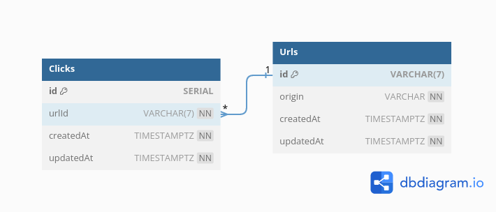

# Pendekin Design Documentation

## Project Details

- Author: gawgaw
- Developer: gawgaw
- Version: 1.0
- Description: A service that helps to shorten a long URL and manage those shortened URLs.

 

## Minimum Viable Product
- User can submit a long URL and get a shortened URL as long as the user's requests haven't exceeded limit
- Somebody can uses the shortened URL and gets redirected to the original long URL
- User can see how many people clicked the shortened URL

 

## Entity Relation Diagram

 

## Application Diagram Flow

### User generates a shortened URL

### Somebody clicked the shortened URL

### User requests data on the number of people clicked the shortened URL

 

## Design Challenges